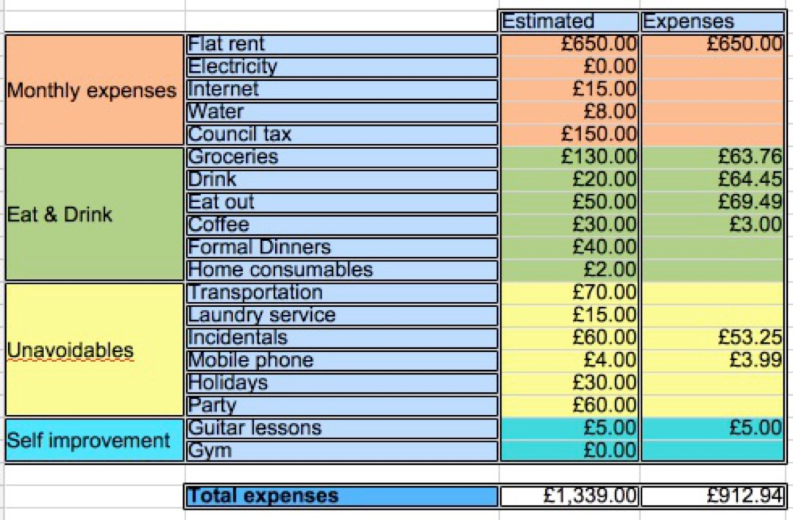

### 2. MINIMISE YOUR EXPENDITURE TO MAXIMISE YOUR SAVINGS

Now that you know your expenditure habits, it's time to act on them. Realise how much money you spend on things you don't need, and things that you eat or drink that are bad for your health. Cut toxic habits out. Restrict expensive habits. Try to be more smart about making the most out of your resources, try to get deals in the supermarket that you can easily stock. We are looking for all those pennies that we can spare – and we didn't even know we could! This will be the beginning of our savings, and where we will start building up our wealth.

Saving is always a great thing but sometimes hard for people with some habits. Some of you may have expensive tastes, like clothes, restaurants or trips. This doesn't mean you should ditch them immediately. Your life is your most precious resource and you should enjoy it to the fullest! But being smart about money, or financially savvy, will allow you to live more carefree, and probably to enjoy it further.

Remember saving is always the cheapest money! You will see further down the line with investing, once you start having money and investing it, even when you get good rates you will be risking a lot of money for the promise of a small reward, that you could have easily saved instead. To give you an example, in order to generate £100 from investments, at an annual rate of 5%, you will need to invest £2000. That means that you need to take £2000 from your pocket and risk losing it, only for the promise of a reward of £100 after a year, which you probably could have saved easily by cutting one food delivery every couple of months. Besides, your benefit is subject to taxing retentions, whereas your savings are always tax-free. See? Saving is cheaper! It's easier! And it's the foundation of our financial plan, so you better be committed if you want to make it there!

Adjust your original budget, and try to stick to it. Don't spend on concepts that you planned to not spend, and don't go beyond the threshold on the rest. Now you have actual power over how much money you can save (generate) per month. You should keep reviewing your budget in the long term, as your needs will change with time.

